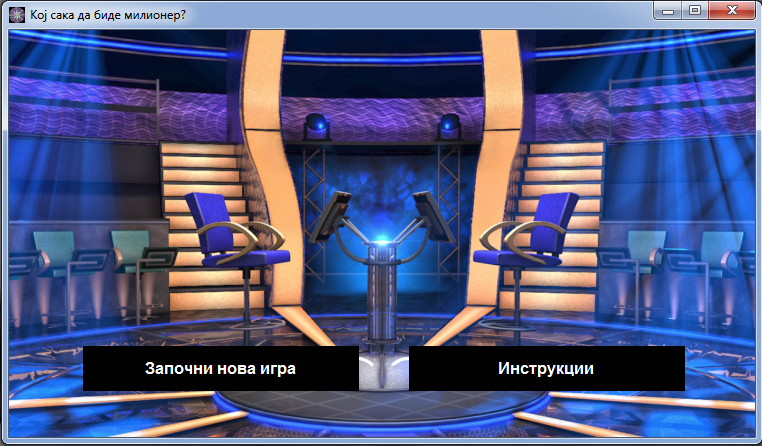
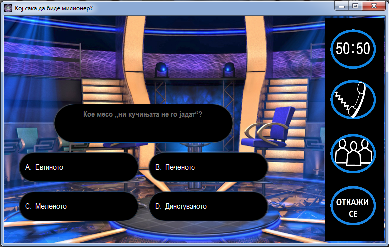
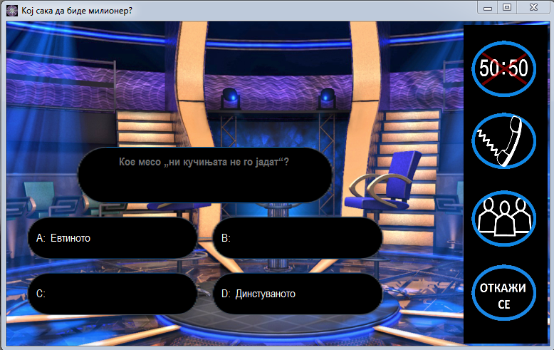
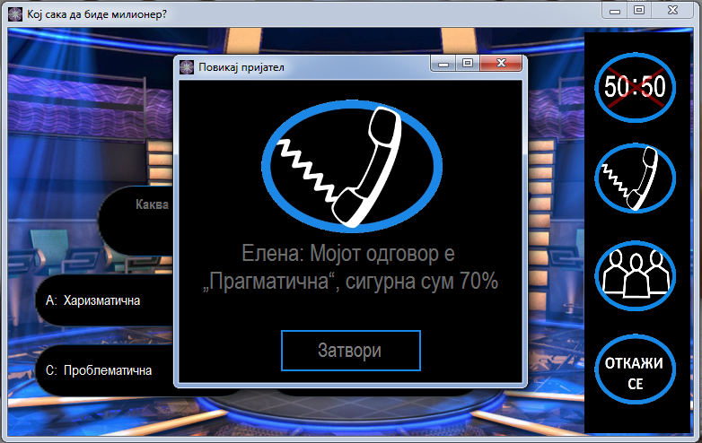
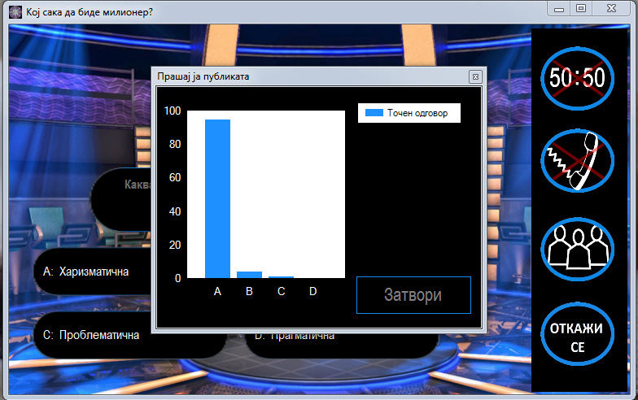
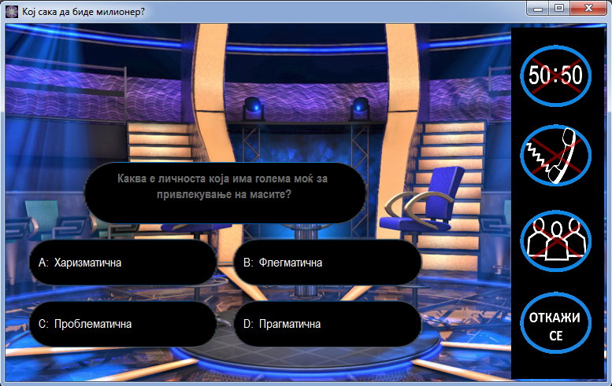

# Кој сака да биде милионер?
## Проектна задача по Визуелно програмирање

#### Изработена од: Синтија Стеваноска, Ирена Спиридонова и Ивана Стојковска
#### Апликацијата е имплементација на квиз во стилот на популарниот „Кој сака да биде милионер?“.
### 1. Начин на користење
Квизот се состои од 15 прашања поделени во 3 нивоа на тежина. За секое одговорено прашање се добива одредена сума на пари.
Има 2 загарантирани суми: кога играчот ќе го одговори точно 5-тото прашање, и кога ќе го одговори точно 10-тото прашање.
Достапни се и 3 вида на џокери: „50-50“, „Повикај пријател“ и „Прашај ја публиката“. 
Сите овие, како и други функционалности, се опишани подетално во текстот понатаму

##### Почеток на квизот

На почеток, на корисникот му се покажува иницијална форма на која може да ги прегледа инструкциите како да го игра квизот, како и копче
со кое може да ја започне играта.

##### Одговарање на прашањата

Откако играчот ќе почне да ја игра играта, на екран му се покажува прашање и 4 можни одговори (A, B, C, D). 
За да може да одговори, играчот треба да кликне со глувчето на текстот од еден од понудените одговори - наместо стандардната стрелка, 
како покажувач на глувчето ќе се постави рака.
Доколку кликне на некој од одговорите, се појавува форма која го прашува дали тоа е неговиот конечен одговор. Ако одбрал точен одговор
, му се покажува нова форма која прикажува која е моменталната освоена сума, а во спротивен случај (корисникот кликнал на грешен одговор) се појавува форма која покажува која е неговата моментална добивка, односно неговата последна загарантирана сума
и го враќа на почетниот екран.
Стандардно, доколку играчот изгуби на < = 5 прашање добива 0 денари, на < = 10 добива 5.000, а на > 10 добива 125.000 денари.
На почеток бојата на сите одговори е бела, кога некој е селектиран текстот се бои портокалово, а доколку 
одговорот е точен, текстот ќе биде во зелена боја.
Целта е играчот точно да ги одговори сите 15 прашања.

##### Користење на џокерите
Сите џокери може да се искористат само еднаш во текот на играта.
Кога еден џокер ќе се искористи, на соодветната слика се поставува црвен X за да се означи дека џокерот се искористил.

Џокер 1: 50-50

Со клик на сликата со 50-50 играчот го искористува џокерот, и со тоа елиминира 2 одговори, при што како опција му
остануваат еден точен и еден неточен одговор. Доколку за едно прашање се искористи 50-50, според правилата за игра
не смее да се користи ниеден од останатите 2 џокери на истото прашање. 

Џокер 2: Повикај пријател

Со клик на сликата со телефонска слушалка се искористува џокерот и со тоа се „повикува“ пријател. Се појавува нова форма
на која го пишува името на пријателот, одговорот кој го дава и процентот на сигурност за точноста на истиот. 
Одговорот рандом се бира од еден од понудените, а процентот е во рангот 20%-70% ако одговорот е грешен, а 80%-100% 
ако одговорот кој го нуди пријателот е точниот одговор на прашањето.

Џокер 3: Прашај ја публиката

Со клик на сликата со публика се активира џокерот, кој генерира рандом проценти за различните понудени одговори, при што
највисок процент се генерира за точниот одговор.

Како четврта опција, играчот може да се откаже од играње и да си замине со последната освоена сума, при што играта
завршува и се враќа на почетниот екран.

### 2. Решение на проблемот

Податоците за квизот се чуваат во локална база Questions.mdf. За да работи, на базата и е потребен Microsoft SQL Server. Бидејќи прашањата се поделени на три нивоа, во базата има три посебни табели со прашања за секое ниво одделно (Level1, Level2, Level3). Секоја од табелите се состои од id (self increment), прашање (штo ја содржи содржината на прашањето), колони за понудените одговори (a,b,c,d) и точен одговор.

##### Пoполнување на прашањата

Oткога ќе се избере опцијата за почеток на игра на стартната форма, се повикува формата Form1, каде со настанот Form1_Load се повикува функцијата PopolniPrasanje(). Таа е поделена на три дела: PopolniPrasanje1(), PopolniPrasanje2(), PopolniPrasanje3() за секое ниво соодветно. Од 1-во до 5-то прашање е прво ниво, од 6-то до 10-то е второ ниво и од 11-то до 15-то е трето ниво. 

--screenshot - popolniPrashanje--

Функцијата PopolniPrasanje1() започнува со генерирање на соодветниот SELECT query string за пребарувањето и го постатува конекцискиот стринг. Потоа со користење на SqlDataReader се читаат сите записи во базата кои одговараат на SELECT стрингот. Во овој случај се земаат сите од табелата Level1. Следно се генерира рандом број од 0 до бројот на податоците во базата. Тоа се прави со функцијата GenerateQuestionNumber. Во исто време како што се генерира број се додава во листа Pominati со цел да нема поклопување на прашањата(во иста игра да се случи едно прашањата два пати да се појави.)

--screenshot - sqlkonekcija--

Следно се повикува GenerateTryBlockForQuestions(connection, cmd, k) функцијата, која на влез ги прима SQL конекцијата, SQL командата и предходно генерираниот број со чија помош ќе пребаруваме низ базата (преку id). SqlDataReader-от чита се додека не дојде до посакуваното id и ги прикажува сооодветните информации за него. Ги пополнува прашањето и 4-те 
понудени одговори. 

##### Селекција на одговор и следно прашање

Сега корисникот треба да го даде својот одговор. Тогаш се повикува следнава функција:

--screenshot - buttonClick--

Во неа дали содржината на копчето се поклопува со точниот одогвор во базата за соодветното прашање. Ако одговорот е точен се отвара нова форма, формата Status, во која му се прикажува на корисникот која е сумата што ја освоил со точниот одговор на прашањето. На 5-то и 10-то прашање пишува дека корисникот дошол до загарантирана сума од 5.000 и 125.000. Статус формата има timer и самата се гаси после 4 секунди. Потоа повторно се повикува функцијата PopolniPrasanje() и се користи на истиот принцип како претходно. 
Ако одговорот е погрешен, играта завршува. На корисникот му се прикажува WrongAnswerForm формата каде го пишува точниот одговор на згрешеното прашање и го враќа на стартната форма каде може да започне нова игра.
Важен момент е и формата за конечен одговор, ако корисникот не стисне ДА по селектирањето на копчето горенаведената проверка нема да се направи. 

--Ѕcreenshot - FormFinalAnswer--	

Истава функција се генерира при клик на било кој одговор (a,b,c,d).

